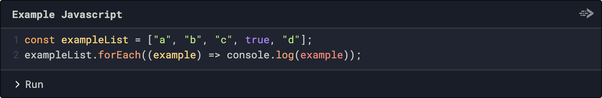
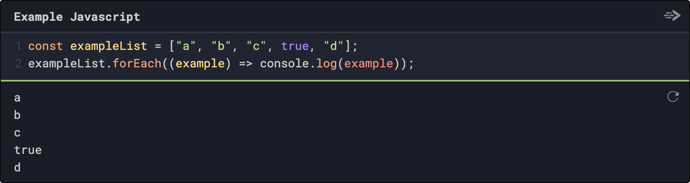

# Gatsby Remark Codefence

This plugin hooks into [gatsby-transformer-remark](https://www.gatsbyjs.org/packages/gatsby-transformer-remark/) to add [Codefence](https://codefence.io/) styled code formatting blocks to your website.

Codefence creates interactive and runnable code sections; this plugin transform generic code formatted blocks in Markdown into their associated Codefence blocks.

Thus, this:

```js heading="Example JavaScript"
const exampleList = ["a", "b", "c", true, "d"];
exampleList.forEach((example) => console.log(example));
```

Becomes this:



Which can then be run within the browser to produce:



## Installation

You can add `gatsby-remark-codefence` to your Gatsby site using NPM or yarn:

- `npm install --save gatsby-remark-codefence`
- `yarn add gatsby-remark-codefence`

After that, all you need to do is add `gatsby-remark-codefence` to your list of Remark plugins in your `gatsby-config.js` file:

```javascript
// In gatsby-config.js
plugins: [
  {
    resolve: `gatsby-transformer-remark`,
    options: {
      plugins: [
        //...
        `gatsby-remark-codefence`,
      ],
    },
  },
];
```

**Note**: order matters within your `gatsby-transformer-remark` plugin; if you have other code formatting markdown plugins installed (like `gatsby-remark-prismjs`), whichever plugin is listed first will take precedence when applying code formatting.

## Usage

For a full list of the available options that can be used when formatting your Codefence sections, please refer to [their documentation](https://codefence.io/). At the time of publication, these are the options that you can use when formatting:

- `lang`: this is determined by the language set on the triple-backtick, at the moment the following languages are supported -- Ada, C/C++, C#, Clojure, Crystal, D, Dart, Elixir, Erlang, Forth, GNU Assembly, Go, Haskell, Java, JavaScript, Kotlin, Lua, Perl, PHP, Python, R, Raku, Ruby, Rust, Scala, Swift, TypeScript, Zig
- `version`: some of the languages supported have multiple versions that you can specify. Check the Codefence site for the up-to-date list, not all languages have configurable versions
- `heading`: this is an extremely useful option, which shows a heading title for your code section (as shown in the example)
- `artifact`: if your referenced code uses local files on your site, specify them here. There's an example on the Codefence site at the moment that uses Rust to write to a pre-existing file
- `cache` : set to false using "cache=false" on the opening line of your code if you are printing something like the current time in your examples, otherwise after the first time you use a code section, it becomes cached by Codefence. Otherwise, examples are cached for 24hrs at a time until their contents change.

## Contributions

Contributions are welcome!
